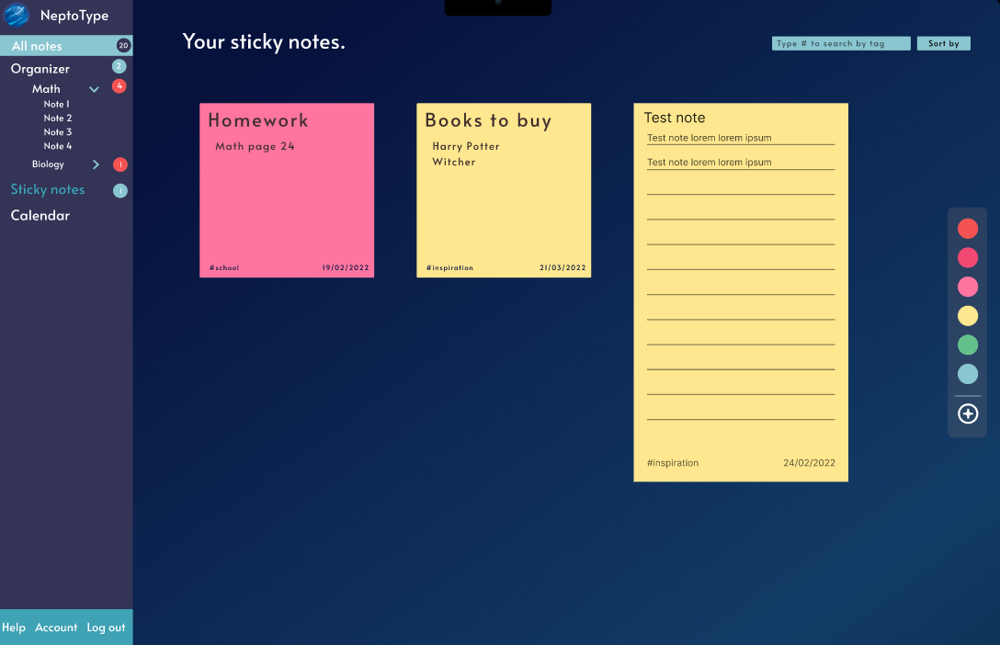
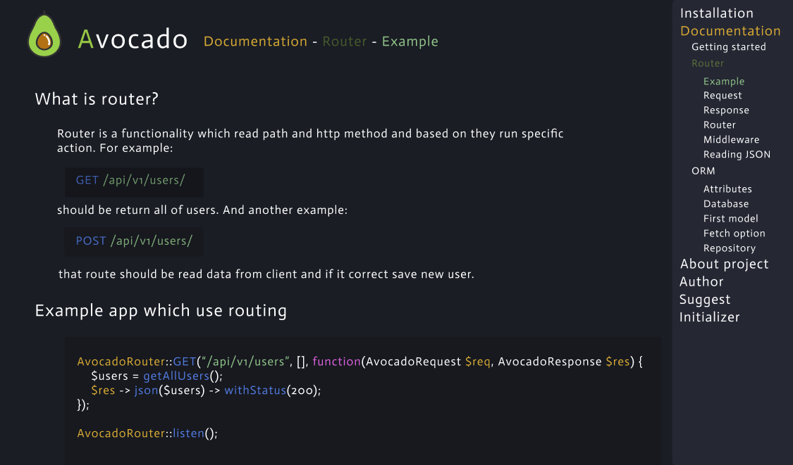
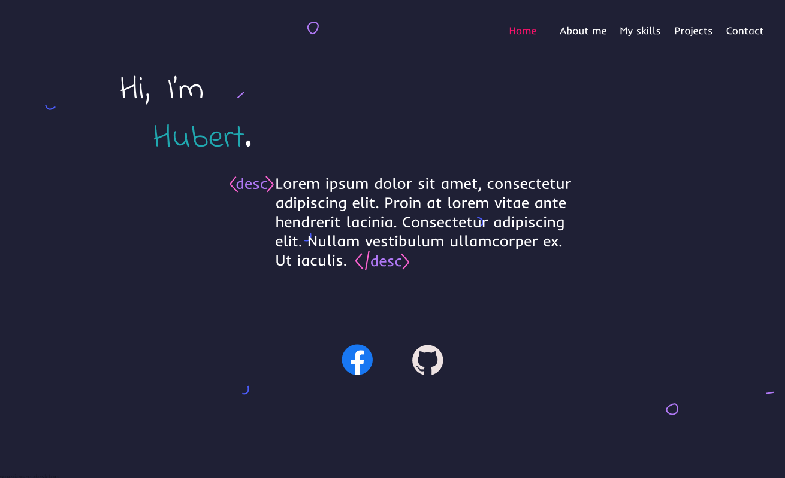
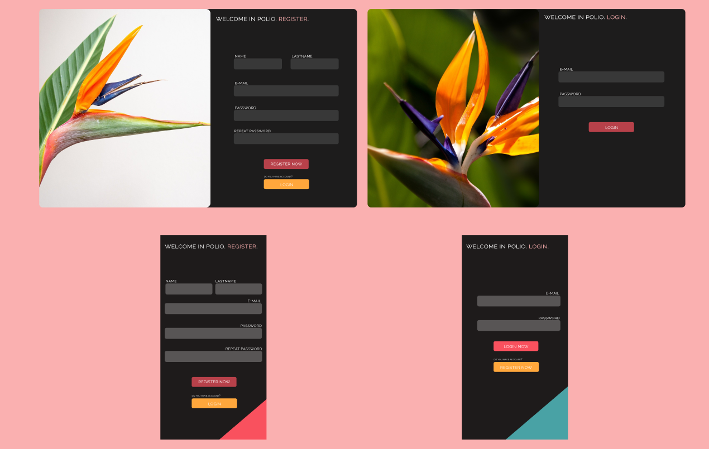

### 🌿 Hi, I am Hubert

And I am junior fullstack developer from Poland. I love programming and everything related.
I am interested in UX/UI, designing, reading fantasy
 

    <h2 align="center">My technology stack</h2>
    
    

    <h2 align="center">My Github Stats </h2>
    
    &theme=dracula" alt="">  
    
    

## Main Projects

### &emsp; 🥑 Avocado - [Repository](https://github.com/HubertKuch/Avocado.git) - [Documentation](https://avocadoframework.com)
#### &emsp;&emsp; Fullstack framework for PHP which implement routing (with middleware) and SQL ORM and I want to do MongoDB ORM. Avocado was build using only clear PHP and with two project pattern `Factory` and `Decorator`. 

### &emsp; 🥑📘 Avocado Documentation - [Repository](https://github.com/HubertKuch/avocado-net.git) - [Page](https://avocadoframework.com)
#### &emsp;&emsp; Web documentation of `Avocado` to describe how use it with examples and instructions. Written in `React` and `SCSS`.

### &emsp; 👨🏻‍💻️ My Portfolio - [Repository](https://github.com/HubertKuch/portfolio.git) - [Page](https://hubertkuch.pl)
#### &emsp;&emsp; My portfolio to show my experience, projects and what I can do. Written in `React`.

### &emsp; 🌆 City Builder - [Repository](https://github.com/HubertKuch/simcity.git)
#### &emsp;&emsp; Multiplayer browser game built with `NodeJS`, `Express`, `TypeScript`, `MongoDB`, `Socket.io` and `Pug`. Every player can add others to friend and check their city, level-up, earn money and buy new buildings.

### &emsp; 📊 MySQL Manager - [Repository](https://github.com/HubertKuch/mysql-full.git)
#### &emsp;&emsp; Desktop MySQL manager written in `Vue`, `Typescript` and `Electron`. Share following methods: describing table structure, creating tables, relations, inserting, deleting, updating and selecting data from selected database.  

## 📖 Experience
### Commercial experience
#### - `Symbiont` December 2021 - Now
#### - Six completed freelance orders in `PHP`, `React` and RestAPI's.
### Non-commercial
#### - Two years of learning
#### - Own projects

## My Designs
[NeptoType](https://www.figma.com/file/d3YjvIMI5IS7431a46ooKP/NeptoType?node-id=0%3A1) - Application to make sticky and markdown notes with calendar.

[Avocado Documentation](https://www.figma.com/file/DAqZpZtCkiEiVDcPNCL3fv/Avocado-Documentation)

[My portfolio](https://www.figma.com/file/6gBJQQJEnimPrIAOF5GQjD/portfolio)

[Pilio](https://www.figma.com/file/6gBJQQJEnimPrIAOF5GQjD/pilio) - Application to share pictures with friends 

[NeptoType](https://www.figma.com/file/d3YjvIMI5IS7431a46ooKP/NeptoType?node-id=0%3A1)
